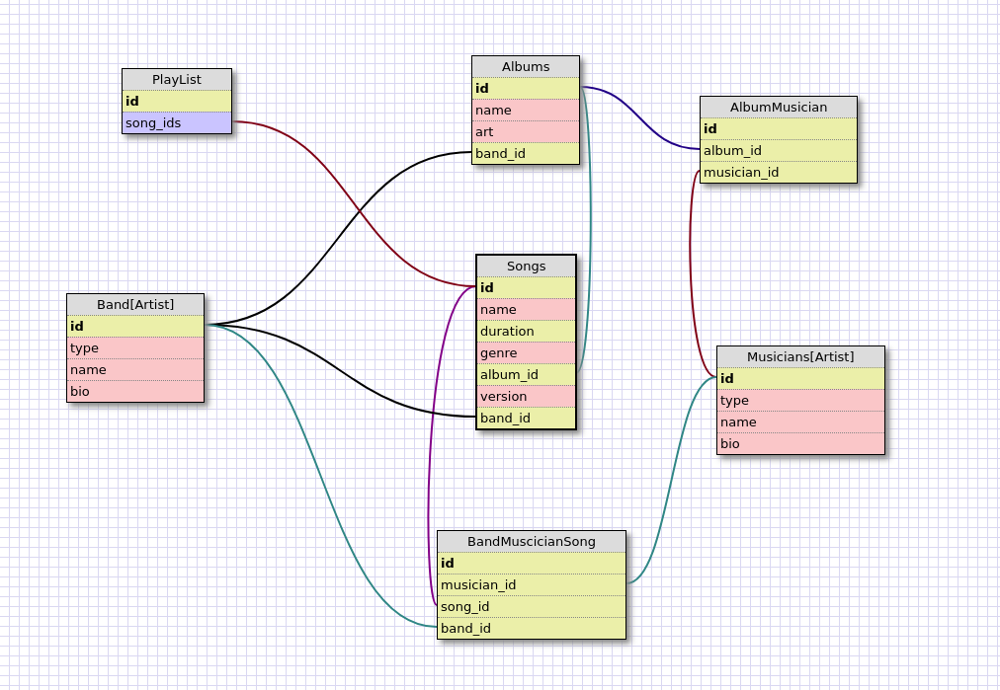

# Architecture Decision Record

### 2018-05-18 - Framework to be used

* Context: Select a framework to build a music API, primary options are Rails, Grape or Rails with Grape

* Decision: Grape as Rack App, without Rails

* Consequences:

  * Lose some cool tools that Rails brings out of the box, that can need to be added to the project.
  * Remove the unnecessary Rails' gems and structure that is not needed.
  * Take advantage of Grape that is built to work with APIs, and has a complete set of facilities.

### 2018-05-18 - Database Type and ORM to be used

* Context: First decide about using a relational or non-relational database, after that decide which ORM and will be used. Players here are PostgreSQL, MySQL, and MongoDB. And ORM ActiveRecord, Sequel, and MongoId.

* Decision: Use a Relational database: PostgreSQL and ActiveRecord gem as ORM.

* Consequences:

  * The many to many relations fits better to a relational database
  * Sequel and ActiveRecord provides similar model functionalities. AR wins here, only because it is the most used in Ruby programming.

### 2018-05-18 - Database Models Design

* Context: Define the Entities and its Relations that will support the requirements.

* Decision: Identify Entities and Relations between they, but do not implement until were necessary.

* Consequences:

  * The main element here is the **Song**, that permit duplicates on *name*, but not on *version*, could belong to a **Band** and/or an **Album** or not, but should have at least one **Musician** or many.
  * **Musician** & **Band** fit well to a STI: **Artist**
  * The missing actor here is the **User** that's the owner of the **PlayList**
